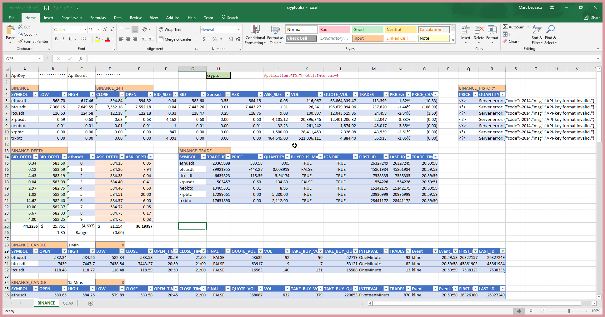

# crypto-rtd
Excel RTD server sourcing GDAX ticker data via websockets

The code is using the old .NET Framework 4.0 in order to allow it
to run on Windows 7 machines.

## Installation
1. Clone the repository and go to its folder.
2. Compile the code using Visual Studio, MSBuild or via this handy script file:

   `build.cmd`

3. Register the COM server by running the following script in admin command prompt:
   
   `register.cmd`

## Usage

Once the RTD server has been installed, you can use it from Excel via the RTD macro.
This is the syntax:

`=RTD("crypto",, "GDAX", instrument, field)`

*All* currency pairs traded on GDAX are supported, including the main ones:
* BTC-USD
* ETH-USD
* LTC-USD
* ETH-BTC
* LTC-BTC

You can use the following fields:
* BID - best bid price
* ASK - best ask price
* LAST_PRICE - last traded price
* LAST_SIZE - last traded size
* LAST_SIDE - last trades side (buy or sell)

